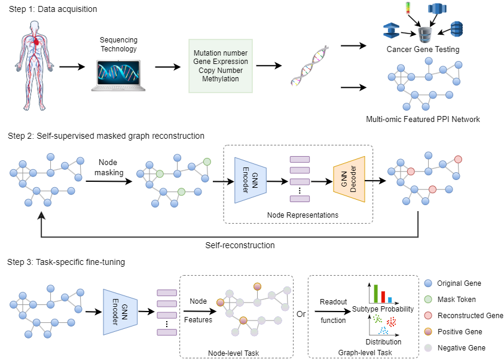

## SMG: self-supervised masked graph learning for cancer gene identification.




## Installation

1. Clone the repository:

   ```shell
   git clone https://github.com/C0nc/SMG.git
   ```

2. Navigate to the project directory:

   ```shell
   cd SMG
   ```

3. Install the required dependencies:

   ```shell
   pip install -r requirements.txt
   ```

   This will install all the necessary packages specified in the `requirements.txt` file.

## Usage

0. Predefined protein-protein interaction network index:

   ```shell
   ['CPDB', 'IRefIndex', 'PCNet', 'IRefIndex_2015', 'STRINGdb', 'Multinet']
   ```

1. Run to train the model to predict the gene nodes by the semi-supervised transductive learning:

   ```shell
   python main_transductive.py [arguments]
   ```

   Provide the required arguments based on your project's needs. Below are the available arguments:

   - `--ppi`: Choose the train protein-protein interaction network based on the defined network index.
   - `--inductive-ppi`: Choose the test protein-protein interaction network based on the defined network index (when inductive learning is needed).
   - `--expression`: Change the task to essential gene prediction.
   - `--health`: Change the task to health gene prediction.
  
Example output:

```shell
Namespace(seeds=[0], device=0, max_epoch=1500, warmup_steps=-1, num_heads=4, num_out_heads=1, num_layers=3, num_hidden=256, residual=True, in_drop=0.4, attn_drop=0.1, norm='layernorm', lr=0.1, weight_decay=0, negative_slope=0.2, activation='relu', mask_rate=0.5, drop_edge_rate=0.2, replace_rate=0.2, encoder='gcn', decoder='gcn', loss_fn='sce', alpha_l=3, optimizer='adam', max_epoch_f=500, lr_f=0.01, weight_decay_f=0.001, linear_prob=False, load_model=False, save_model=False, use_cfg=False, logging=False, scheduler=True, concat_hidden=False, pooling='mean', deg4feat=False, batch_size=32, inductive_ppi=-1, ppi=0, health=False, inducitve=False, essential=False, task='GIN_graph', data_path='', GE=False, IGE=False)
####### Run 0 for seed 0
! Linear Residual !
Identity Residual 
Identity Residual 
sce
2023-06-12 19:08:46,515 - INFO - Use scheduler
2023-06-12 19:08:46,519 - INFO - Start training...
# Epoch 1499: train_loss: 0.1404: 100%|███████████████████████████████████████████████████████████████████████████████████████████| 1500/1500 [00:45<00:00, 32.87it/s]
num parameters for finetuning: 199299
tensor(537., device='cuda:0') tensor(1476., device='cuda:0')
# Epoch: 499, train_loss: 0.4631, val_loss: 0.8206, val_auc:0.7747391209580134, test_loss: 0.6556, test_aupr: 0.8171: 100%|██████████| 500/500 [00:07<00:00, 68.73it/s]
--- Testaupr: 0.8171, early-stopping-Testaupr: 0.8162, Best Valaupr: 0.7836 in epoch 452 --- 
# final_aupr.8162±0.0000
# early-stopping_aupr.8162±0.0000
```


2. Run to train the model to predict the graph property:

   ```shell
   python main_graph.py --use_cfg [arguments]
   
   - `task`: Choose the architecture GIN_graph/GCN_graph
   ```
   
Example Output
   
```shell
2023-06-12 19:34:13,410 - INFO - Using best configs
------ Use best configs ------
Namespace(seeds=[0], device=0, max_epoch=60, warmup_steps=-1, num_heads=2, num_out_heads=1, num_layers=2, num_hidden=512, residual=False, in_drop=0.2, attn_drop=0.1, norm='batchnorm', lr=0.00015, weight_decay=0.0, negative_slope=0.2, activation='relu', mask_rate=0.5, drop_edge_rate=0.0, replace_rate=0.0, encoder='gin', decoder='gin', loss_fn='sce', alpha_l=1, optimizer='adam', max_epoch_f=500, lr_f=0.005, weight_decay_f=0.0, linear_prob=True, load_model=False, save_model=False, use_cfg=True, logging=False, scheduler=False, concat_hidden=False, pooling='mean', deg4feat=False, batch_size=32, inductive_ppi=-1, ppi=0, health=False, inducitve=False, essential=False, task='GIN_graph', data_path='', GE=False, IGE=False)
Graphs class 0: 200, Graphs class 1: 306
Length of balanced dataset list: 400
Train graph class 0: 160, train graph class 1: 160
Validation graph class 0: 40, validation graph class 1: 40
####### Run 0 for seed 0
sce
Epoch 59 | train_loss: 0.1025: 100%|██████████████████████████████████████████████████████████████████████████████████████████████████| 60/60 [00:48<00:00,  1.25it/s]
#Test_f1: 0.8700±0.0510
# final_acc: 0.8700±0.0000
```
   

3. Run to conduct the post-hoc explanation by the GNNExplainer and the Integrated Gradient:

   ```shell
   python main_transductive.py [arguments] 
  
   - `GE`: Utilize the GraphExplainer to explain the prediction results.
   - `IGE`: Utilize the Integrated Gradient to explain the prediction results.
   ```

## Reference Website

1. You can choose the target gene sets enrichment analysis based on the list in this reference website:

   [https://maayanlab.cloud/Enrichr/](https://maayanlab.cloud/Enrichr/)

2. More information about Cancer Gene can be found at:

   [http://ncg.kcl.ac.uk/](http://ncg.kcl.ac.uk/)

## Data available

Get the data from this Google Drive link:

[https://drive.google.com/file/d/1Kfj2xdCbmRPpRn9s-0BqP33Z5wzoyv2m/view?usp=drive_link](https://drive.google.com/file/d/1Kfj2xdCbmRPpRn9s-0BqP33Z5wzoyv2m/view?usp=drive_link)

## License

This project is licensed under the [MIT License](LICENSE).

## Reference
Cui Y et al., SMG: self-supervised masked graph learning for cancer gene identification. Submitted for publication.
